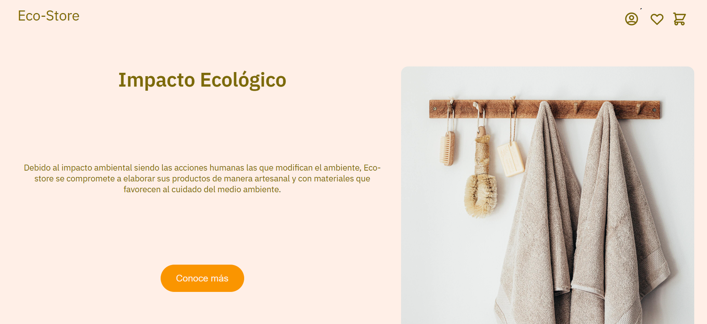
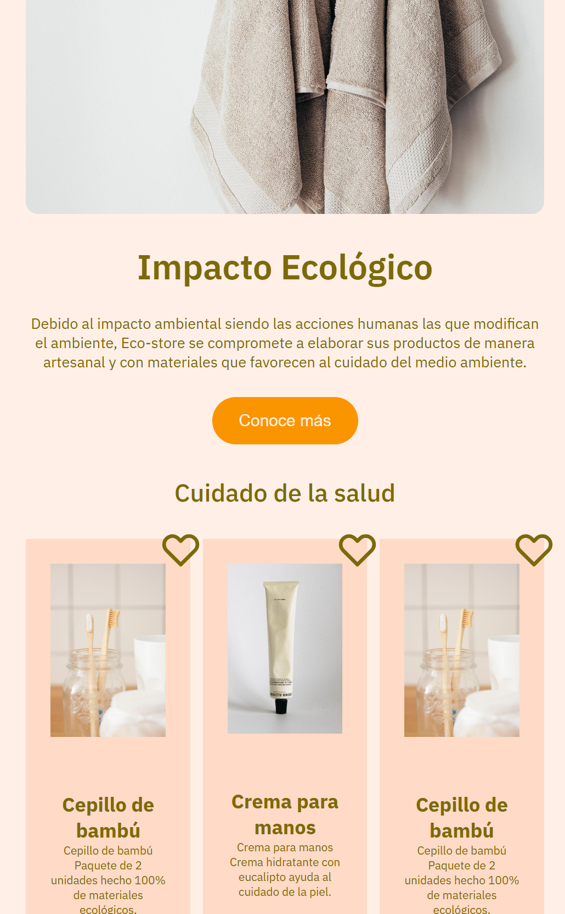

# Eco-store Landing Page 🌿

Landing page **responsive** para una tienda ecológica llamada **Eco-store**, desarrollada con **HTML + CSS usando Sass (SCSS)**, aplicando buenas prácticas de maquetación, estilos reutilizables y una estructura modular para facilitar el mantenimiento.

## 🌐 Demo

🔗 **Sitio en línea:** [https://playful-naiad-0fa33b.netlify.app/](https://playful-naiad-0fa33b.netlify.app/)

---

## ✨ Características

- Diseño moderno y adaptable a cualquier dispositivo (**responsive**)
- Estilos organizados con **Sass (SCSS)** para mayor escalabilidad
- Uso de **CSS Grid** para la sección de productos
- Uso de **Flexbox** para alineación y distribución de elementos
- Tipografía desde **Google Fonts** (IBM Plex Sans)
- Íconos integrados con **Font Awesome**
- Estructura modular con **variables y mixins** para reutilizar estilos
---

## 🛠️ Tecnologías usadas

(Con íconos / logotipos)

* 🌐 **HTML5**
* 🎨 **CSS3**
* 🧩 **Sass / SCSS**
* 📐 **CSS Grid**
* 📏 **Flexbox**
* ⭐ **Font Awesome**
* 🔤 **Google Fonts**

---

## 📂 Estructura del proyecto

```bash
Eco-Store/
├── index.html
├── assets/
│   └── img/
│       ├── twitter-logo.png
│       ├── ...
│       ├── products/
│       │   ├── organic-soap.jpg
│       │   └── ...
│       └── furniture/
│           ├── mini-table.jpg
│           └── ...
├── css/
│   └── main.css
└── scss/
    └── main.scss
```

---

## 🚀 Instalación y uso

1️⃣ Clona el repositorio:

```bash
git clone https://github.com/MarkoEv/LandingPageEcoStore.git
```

2️⃣ Entra al proyecto:

```bash
cd LandingPageEcoStore
```

3️⃣ Abre el proyecto en tu navegador:

* Abre el archivo `index.html`

---

## 🎨 Compilar Sass (SCSS)

Si deseas modificar los estilos desde `main.scss`, puedes compilarlo a CSS con:

### Opción 1: Sass CLI

Instala Sass:

```bash
npm install -g sass
```

Compilar una vez:

```bash
sass scss/main.scss css/main.css
```

Compilar en modo automático (**watch**):

```bash
sass --watch scss/main.scss css/main.css
```

---

## 📌 Propósito del proyecto

Este proyecto fue creado con el objetivo de practicar:

* **maquetación web**
* **diseño responsive**
* implementación de **Sass/SCSS** usando:

  * variables
  * mixins
  * estructura modular

---
## 📸 Capturas





## 👤 Autor

**Marco Antonio Evangelista Armenta**
- Desarrollador Web

---
